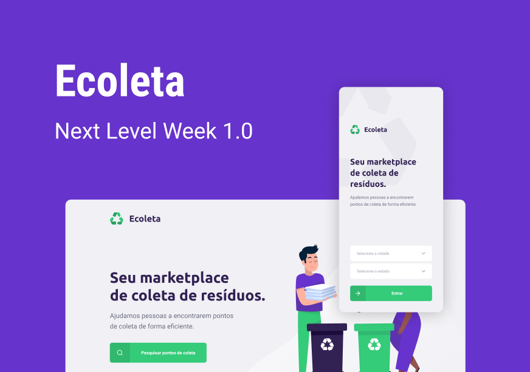

![Node_Badge][node_version] ![Npm_Badge][npm_version] ![React_Badge][react] ![React_Native_Badge][react_native]

 

# Next Level Week 2020 - Ecoleta
 
Essa aplicação foi desenvolvida para aplicar os conhecimentos abordados na Next Level Week 2020, da [Rocketseat](https://rocketseat.com.br/). 

Tem por objetivo o cadastro e visualização de pontos de coleta de variadas categorias, sendo a aplicação web voltada para a inserção de novos estabelecimentos e a aplicação mobile voltada para a consulta dos mesmos.

## Licença
Distribuído sob a licença MIT.

[node_version]: https://img.shields.io/badge/node-12.13.0-green
[npm_version]: https://img.shields.io/badge/npm-6.14.5-blue
[nodejs]: https://img.shields.io/badge/server-nodejs-blue-violet
[react]: https://img.shields.io/badge/web-react-red
[react_native]: https://img.shields.io/badge/mobile-react%20native-blueviolet
